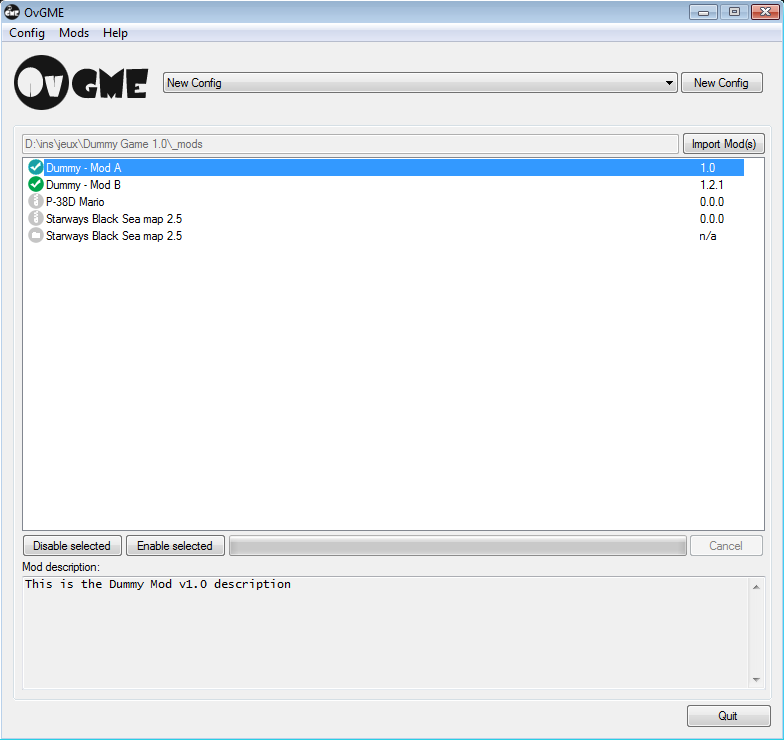

----------------------------------------------------------------------------------------
#OvGME
Enhanced Generic Mod Enabler and manager.
----------------------------------------------------------------------------------------
Version: 1.7.2
----------------------------------------------------------------------------------------

Home page: https://github.com/sedenion/ovgme

Presentation
----------------------------------------------------------------------------------------
OvGME is a Mod manager based on the idea and concept of JSGME, it take the GME acronym
from JSGME which stands for Generic Mod Enabler. The main purpose of OvGME is to provide an
easy way to import and enable mods for games then restore original files when disabling mods.
OvGME works by comparing the destination folder file tree with the given mod file tree,
then identifies what files to replace, create and save as backup.

OvGME implements the following key features:

- Support for multiple destination folder (game, software, etc.) through the main GUI.
- Custom Mods and Backup folder for each destination folder.
- Destination folder file tree snapshot and comparison based on xxHash.
- Zipped Mods files (Mod-Archives).
- Mods description (readme.txt).
- Mods versioning.
- Mods enabling profile for each destination folder.
- Mods network repositories.
- Mods online updating and downloading.
- Zip Mod-Archive creation tool.
- XML repository creation tool.
- Detailed embedded Help.

###If you already use JSGME
Please read carefully the "OvGME and JSGME" chapter in the embedded help before doing
anything.

Screenshots
----------------------------------------------------------------------------------------

